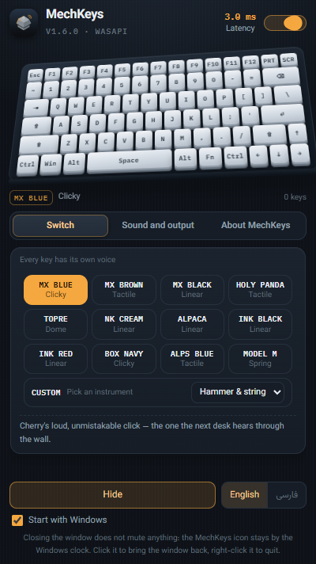
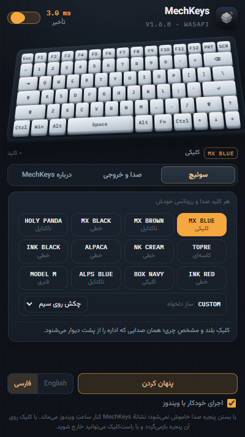

# MechKeys

Mechanical keyboard sounds for Windows. Every key on the board plays a real
recording of a real switch, routed by where that key sits on the plate, with a
global keyboard hook and a WASAPI output that answers in a few milliseconds.



The same window in Persian; English is the default. The **English / فارسی**
control at the bottom switches the interface, the reading direction, the tray
menu and the title bar in one click.



Your keyboard does not sound like a recording of one key. MechKeys reads each
press by physical position: the middle of the plate rings looser and lower, the
keys near the case are tighter and sharper, and repeated presses of one key
draw different samples of the same switch, so the sound never cycles.

Written in Rust with Tauri 2. No installer bloat, no background services, no
telemetry.

---

## Contents

- [Features](#features)
- [Install](#install)
- [Using the window](#using-the-window)
- [Why every key sounds different](#why-every-key-sounds-different)
- [Latency](#latency)
- [Exclusive mode and automatic release](#exclusive-mode-and-automatic-release)
- [Updates](#updates)
- [Privacy](#privacy)
- [Configuration](#configuration)
- [Command line](#command-line)
- [Building from source](#building-from-source)
- [Repository layout](#repository-layout)
- [Releasing](#releasing)
- [Troubleshooting](#troubleshooting)
- [License and credit](#license-and-credit)

## Features

- **Twelve real switches.** MX Blue, MX Brown, MX Black, Holy Panda, Topre,
  NK Cream, Alpaca, Ink Black, Ink Red, Box Navy, Alps Blue, Model M.
- **Five instruments for CUSTOM mode.** Piano, electric piano, marimba, bell
  and guitar: the board plays notes instead of switches.
- **A voice per key**, taken from its position on the plate rather than one
  file replayed across the whole board.
- **Low latency.** Exclusive WASAPI at a 3.33 ms period; in practice one to two
  milliseconds from the press to the first sample.
- **Automatic release of exclusive mode.** When something else starts playing
  audio, MechKeys steps out of the lock and returns as soon as you type again.
- **Small and cheap at idle.** One executable of about 9 MB, under 0.1 % CPU
  while nothing is happening — measured on 12 cores with the window open.
- **Updates from GitHub**, one click, entirely optional — from the window or
  from the tray menu.
- **Two languages.** Persian (right to left) and English (left to right), with
  the choice kept in the settings file.
- **System tray, and an optional start with Windows.**
- **Installed or portable.** Same executable; a portable copy keeps its
  settings in a `data` folder next to itself.

Windows 10 and 11, on both 64-bit and 32-bit machines. Windows only: the global
keyboard hook, the WASAPI output and the session monitor are all Windows
interfaces, and on Linux a system-wide key listener is not permitted under
Wayland at all.

## Install

Each release carries four files. Two installers and two portable archives, one
of each pair for every word size:

| File | Runs on | Installs? |
| --- | --- | --- |
| `MechKeys_x.y.z_x64-setup.exe` | 64-bit Windows | Yes |
| `MechKeys_x.y.z_x86-setup.exe` | 32-bit Windows | Yes |
| `MechKeys_x.y.z-portable-x64.zip` | 64-bit Windows | No |
| `MechKeys_x.y.z-portable-x86.zip` | 32-bit Windows | No |

### Installer

Download `MechKeys_x.y.z_x64-setup.exe` from the
[latest release](https://github.com/mohsenNBI/MechKeys/releases/latest) and run
it. Take the `x86` file only if your machine reports a 32-bit operating system.
The program installs to `%LOCALAPPDATA%\Programs\MechKeys` and then sits in the
system tray.

If Windows shows a SmartScreen warning on the first run — the installer carries
no paid publisher signature — choose **More info** and then **Run anyway**.

### Portable

Unzip either archive anywhere you like — a USB stick, a Documents folder, a
roaming profile — and run `mechkeys.exe`. Nothing touches the registry beyond
the optional start-with-Windows entry, and the settings stay inside the folder
as `data\config.json`, so the whole program moves with you and remembers how
you left it. The About tab marks such a copy with `· portable` next to the
version, and it is never offered an installer download: a portable copy is
replaced by hand.

An installed copy that grows a `data` folder beside its executable starts
reading and writing its settings there, and the other way round — delete the
folder and it goes back to `%APPDATA%\MechKeys`.

## Using the window

The window is 400 × 712 pixels and holds one thing at a time: the keyboard, and
three tabs of settings beneath it.

| Control | What it does |
| --- | --- |
| The switch at the top of the window | Turns the sound on or off. The keyboard hook stays installed. |
| The keyboard itself | Click a key to hear that one key in the current profile. The board also lights up as you type, even while the window is hidden. |
| Switch cards | Change the switch, and play one sample of it immediately so you can hear it. |
| **CUSTOM** | Replace the switch sound with one of five instruments, chosen from the list inside the card. |
| The three tabs below the board | Divide the settings: switch, sound and output, about. |
| Volume slider | Loudness of the key sounds, not of Windows. Arrow keys do not set it, because arrow keys are meant to make sound here. |
| **Test play** | One strike of whichever switch or instrument is selected. |
| **Exclusive mode** | Lowest possible latency; takes the audio device exclusively. |
| **Release automatically** | Gives up that lock while a video or a song plays elsewhere. |
| **Key release sound** | The short click of a keycap coming back up. |
| **Check for updates** | Asks GitHub for the newest release. |
| **Hide** | Closes the window and keeps the sound running; the icon stays by the clock. |
| **Start with Windows** | Writes or clears the `HKCU\...\Run` entry. |
| **English / فارسی** | Changes the interface language, the tray menu and the title bar, and remembers it. |

The window has no quit button on purpose. Right-click the icon by the Windows
clock for its menu: **Show**, **Check for updates** and **Quit**. A left click
on that icon does the same as **Show**.

### The keyboard on the window

The board is drawn as a 65 % layout: sixty grid columns, six rows, seventy-nine
caps, with the arrow cluster sitting in the bottom-right notch instead of
floating away from the case. Each cap carries the virtual-key code and the scan
code of the key it stands for, so clicking one plays exactly the sound that key
would make — and the same table drives the highlight when you type for real.

While the window is hidden, the hook keeps counting. The last sixty-four presses
are held in a small ring and replayed in order the next time the window paints,
so the board shows what you have just typed instead of freezing on the last
frame before you hid it.

## Why every key sounds different

The samples come from raw switch recordings (source and licence below). Three
layers of processing sit on top of them:

1. **Row-based sample routing.** Every row of the board has its own takes, so
   Space never shares a voice with Shift.
2. **Case resonance.** A band-pass filter per key, whose centre frequency moves
   with the distance from the middle of the plate. Keys near the frame get more
   of the case's metallic knock.
3. **Strike variation.** Each press picks another take from the same row at a
   slightly different level. Holding a key down produces no sustained sound,
   because Windows' auto-repeat events are ignored.

Up to twenty-four voices play at once, so fast typing never drops a key.

### CUSTOM mode and the instruments

In this mode the bank changes: each key plays one note of a D scale, laid out
left to right, so a row of keys is a row of an octave. These sounds are not
recordings — they are built with an additive model in which every harmonic
decays on its own, which keeps extra audio files out of the program. Only the
instrument you select is built, and it is built on a thread separate from the
audio callback, so changing instrument cannot interrupt a sentence you are
typing.

## Latency

Two output paths exist:

| Path | Buffer period | Measured latency |
| --- | --- | --- |
| Shared (default) | 480 frames = 10.00 ms | median 5.4 to 6.6 ms (`--selftest`) |
| Exclusive | 160 frames = 3.33 ms (device minimum) | median 0.8 to 2.7 ms (`--selftest --exclusive`) |

Those figures are the distance from the key press to the first audio sample
being ready, and they move a little on every run; these are four measurements
back to back on the machine this was built on. The window shows the same number
at the top. To see what your own device accepts:

```
mechkeys --probe
```

Exclusive WASAPI locks the audio device, and no other program will produce
sound while it is held. That is what the automatic release is for.

## Exclusive mode and automatic release

With that box ticked, the monitor does three things:

- After twelve seconds without a key, it drops the lock and moves the output
  back to shared mode. Video and music work again.
- While audible sound plays from another program, it stays in shared mode. An
  application holding open a silent stream does not block the return.
- When that playback ends and you type again, the lock comes back — usually
  within two seconds.

While the lock is temporarily released, a short note appears beside the option.
To find out which program is holding the device:

```
mechkeys --sessions
```

## Updates

**Check for updates** queries
`api.github.com/repos/mohsenNBI/MechKeys/releases/latest`. If a newer version
exists, the window shows its number, its notes and a link to the release page.
The tray menu offers the same check: it brings the window forward, opens the
About tab and asks, so the answer is on screen either way.
The **Check automatically** box runs that same query once at startup, silently;
it writes anything to the window only when there is something new.

**Get installer** downloads the file into your Downloads folder and stops there.
The program never runs what it has downloaded. That is deliberate: while the
installer carries no paid signature, executing a file fetched from the network
would be a weak link in the supply chain.

The download address comes from the release GitHub answered with, never from
the interface, and only `https://` addresses are accepted. When a release
carries installers for both word sizes, the program picks the one built for the
machine it is running on and never offers it the other.

## Privacy

- Nothing is collected about you, about which keys you press, or about your
  system.
- The only network request this program can make is the GitHub release query.
  With **Check automatically** off and the button untouched, it runs entirely
  offline.
- Settings live in `%APPDATA%\MechKeys\config.json`, or in `data\config.json`
  beside the executable of a portable copy. Nothing else is written to disk —
  unless you download an installer, which lands in Downloads.

## Configuration

```json
{
  "enabled": true,
  "volume": 0.7,
  "profile": "mx-blue",
  "up_sound": true,
  "exclusive": false,
  "auto_release": false,
  "check_updates": true,
  "lang": "en"
}
```

| Key | Meaning |
| --- | --- |
| `enabled` | Whether the sound is on. |
| `volume` | A number between 0 and 1. |
| `profile` | Switch or instrument name — one of the values the interface lists, such as `holy-panda` or `piano`. |
| `up_sound` | Play a sound when a key is released. |
| `exclusive` | WASAPI exclusive mode. |
| `auto_release` | Give up the exclusive lock while other audio plays. |
| `check_updates` | Query GitHub at startup. |
| `lang` | `en` or `fa`. Anything else falls back to `en`. |

## Command line

| Flag | What it does |
| --- | --- |
| *(no flag)* | Normal start, with the window. |
| `--minimized` | Start in the tray, without the window. |
| `--selftest` | A silent test: measures hook → queue → mixer over twenty synthetic presses and reports how long the sound took to arrive. |
| `--selftest --exclusive` | The same test in exclusive mode. |
| `--probe` | Prints the default device's minimum period, sample rate and accepted format. |
| `--sessions` | Lists the audio streams on the default device with their levels, and which one blocks exclusive mode. |

## Building from source

Requirements: Rust (stable), Node 18 or newer, and on Windows the Visual Studio
Build Tools with the C++ component — both the `windows` crate and `webview2`
need `link.exe`.

```bash
cd src-tauri
cargo test --release                            # 51 tests
cargo build --release                           # target/release/mechkeys.exe

npx --yes @tauri-apps/cli@2 build               # installer for this machine
npx --yes @tauri-apps/cli@2 build --target i686-pc-windows-msvc
```

Either build command writes an NSIS installer into
`src-tauri/target/<target>/release/bundle/nsis`. The portable archive is the
matching `mechkeys.exe` and an empty `data` folder, zipped:

```bash
zip -r MechKeys_1.7.0-portable-x64.zip mechkeys.exe data
```

The GitHub Actions build does both, for both word sizes.

The sounds and the icons are part of the repository. To rebuild them from their
originals:

```bash
node tools/build-sounds.mjs   # download the kbsim recordings, trim, normalise, 48 kHz
node tools/gen-icons.mjs      # icons/ and src/icon.png from tools/icon-master.png
```

`gen-icons.mjs` cuts one frame per size from a single 1024 px master — 16, 20,
24, 32, 48, 64, 128 and 256 in `icon.ico`, plus the raw 32-bit frames the tray
and the window icon are built from. Each small frame gets its own sharpening and
contrast pass, because a picture scaled down to 16 px and left alone is a blur;
the program then hands Windows the frame sized for the slot it asked for instead
of letting it grind the 256 px one down. That is why the icon in the title bar,
on the taskbar and by the clock is the same keycap the About tab shows.

### Repository layout

```
src/                 the interface (one HTML file and the fonts)
src-tauri/src/
  main.rs            window, tray, Tauri commands, command-line modes
  hook.rs            the global WH_KEYBOARD_LL hook
  state.rs           event queue, atomic counters, sound bank
  audio.rs           mixer and playback thread
  lowlat.rs          direct WASAPI: shared and exclusive
  sound.rs           switch profiles, instruments, key → sample path
  sessions.rs        the monitor that releases exclusive mode
  update.rs          the GitHub query and the installer download
  config.rs          reading and writing the settings
  autostart.rs       the registry Run key
src-tauri/assets/    the trimmed switch recordings
tools/               the sound and icon builders
.github/workflows/   tests and installer builds on GitHub Actions
```

Each module keeps its own tests, and they test logic rather than hardware: key
routing, sound shaping, the monitor's timing rules, the parsing of GitHub's
answer. None of them needs an audio device.

## Releasing

The repository holds no build output — `target/`, `node_modules/` and
`.cache/` are ignored — so a plain commit of the folder is enough.

```bash
git init -b main
git add .
git commit -m "MechKeys 1.7.0"
git remote add origin https://github.com/mohsenNBI/MechKeys.git
git push -u origin main
git tag v1.7.0 && git push origin v1.7.0
```

The GitHub Actions build runs the tests and produces an installer for each word
size on every push. A `v*` tag additionally publishes those installers, and the
portable archives, onto the release itself — which is where the update button in
the program looks.

## Troubleshooting

| Symptom | What to do |
| --- | --- |
| No sound at all | Turn the switch at the top of the window on, then press **Test play**. If that is silent too, change your Windows output device. |
| Sound arrives late | Turn on **Exclusive mode**, and run `mechkeys --probe` to see what the device allows. |
| No sound while a video plays | Expected: exclusive mode has the device locked. Turn it off, or tick **Release automatically**. |
| Exclusive mode never comes back | Run `mechkeys --sessions`; the "in the way" column names the program holding the device. |
| Programs running as administrator are silent | The keyboard hook cannot see their input. Run MechKeys as administrator too. |
| SmartScreen blocks the installer | More info → Run anyway. |
| The update check reports an error | Check that `api.github.com` is reachable. If GitHub rate-limited the request, try again in a few minutes. |

## License and credit

The program is under the **MIT** licence (see `LICENSE`).

- The switch recordings come from
  [tplai/kbsim](https://github.com/tplai/kbsim) (MIT), trimmed and normalised
  for this use; details in `src-tauri/assets/sounds/LICENSE.md`.
- The Persian face is **Vazirmatn** and the Latin face is **IBM Plex Mono**,
  both under the SIL Open Font License and bundled locally in `src/fonts`.
- Built by [mohsenNBI](https://github.com/mohsenNBI) ·
  Telegram: [mohsen_nbi](https://t.me/mohsen_nbi)
